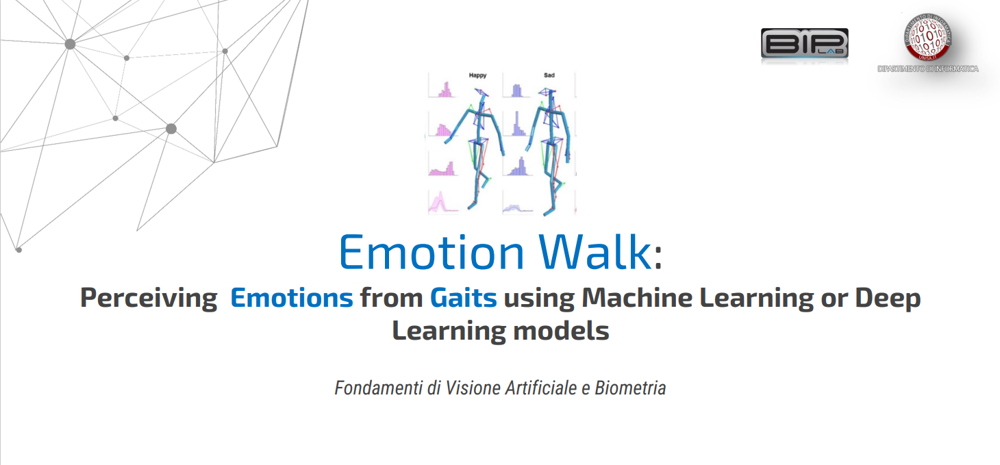
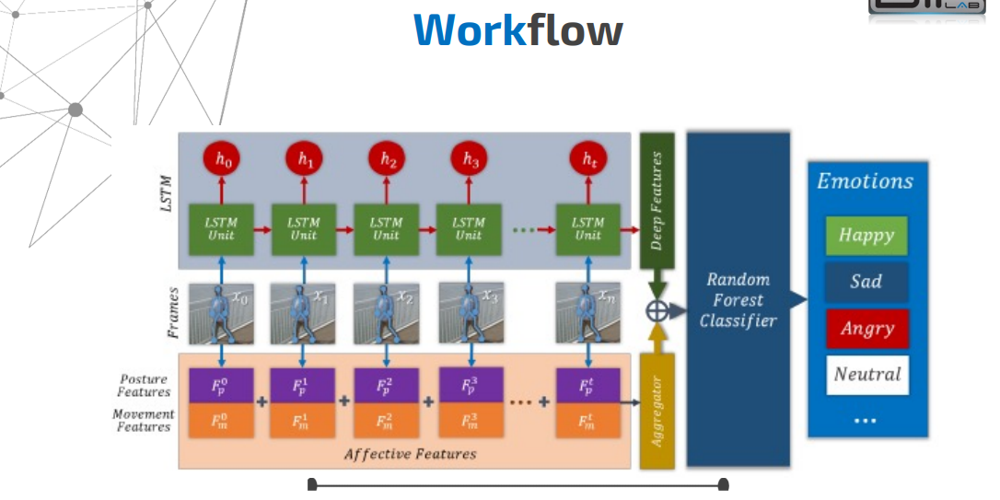
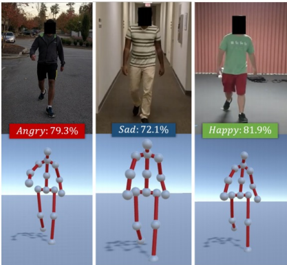

# FVAB_EmotionGate_Coimbra
<picture>
  <source srcset="./readmePhotos/EmotionGait.png" media="(min-width: 680px)">
    <p align="center">  
        
    </p>
</picture>

Table of Contents
=============

* [Project Overview](#project-overview)
* [Model Architecture](#model-architecture)
* [Results](#results)
* [Future Work](#future-work)
* [Setup and Usage](#setup-and-usage)

This project, part of the Fundamentals of Computer Vision and Biometrics course, explores the use of machine learning for emotion recognition through gait analysis. Initially, the project utilized `Long Short-Term Memory (LSTM)` networks for this purpose. In the updated version, a more efficient approach using `Bayesian Networks` (BNs) has been adopted to overcome the limitations of LSTMs, focusing on computational efficiency and robustness to data variability.

The goal is to classify emotions based on video data, particularly focusing on poses and movement patterns. The classified emotions include happiness, sadness, anger, and neutrality.

<picture>
  <source srcset="./readmePhotos/WorkFlow.png" media="(min-width: 600px)">
  <p align="center">    
    
  </p>
</picture>

## Project Overview

The updated project workflow uses a Bayesian Network to analyze statistical features extracted from video data. Unlike the original approach, which relied on the LSTM to capture temporal dependencies, the Bayesian Network provides a probabilistic framework to model uncertainties and relationships between features.

Key steps involved in the updated project include:

- **Data Preprocessing**: Frames are extracted and resized from video data. Emotional percentages are computed from the dataset, normalized, and used as features.

- **Feature Analysis and Selection**: Statistical features such as the percentages of detected emotions (`Happy`, `Sad`, `Angry`, `Neutral`) are computed for each video.

- **Classification**: A `Gaussian Naive Bayes (GNB)` classifier is employed to classify the extracted features into one of the target emotion categories. This probabilistic approach reduces computational costs compared to LSTMs while maintaining accuracy.

<picture>
  <source srcset="./readmePhotos/Emotions.png" media="(min-width: 600px)">
  <p align="center">  
    
  </p>
</picture>

## Model Architecture

### Bayesian Network Architecture
The Bayesian Network approach focuses on simplicity and interpretability:
1. Features such as normalized percentages for emotions (`Happy`, `Sad`, `Angry`, `Neutral`) are computed from the video data.
2. A `Gaussian Naive Bayes` model processes the features. The classifier assumes independence between features, simplifying computation.
3. The output probabilities are used to determine the predicted emotion.

This architecture avoids the complexities of temporal sequence modeling required by LSTM networks, making it computationally efficient and easier to interpret.

<picture>
  <source srcset="./readmePhotos/Bayesian_Network.png" media="(min-width: 480px)">
  <p align="center">    
    
  </p>
</picture>

### Comparison to LSTM Architecture
The original model used a `TimeDistributed Conv2D` layer, multiple pooling and dense layers, and an `LSTM` layer for temporal analysis. While effective, this approach required extensive computational resources and was sensitive to dataset imbalance. The Bayesian approach addresses these limitations, providing a simpler and more robust solution.

## Results

The Bayesian Network demonstrated competitive accuracy while significantly reducing computational overhead. Preliminary results highlighted:
- Improved robustness to imbalanced datasets through techniques such as `SMOTE`.
- Similar accuracy levels compared to the LSTM model, with significantly lower training and testing times.
- Enhanced interpretability due to the probabilistic framework.

## Future Work

Future directions for improving this project include:
- Incorporating multimodal data, such as audio and physiological signals, to enhance classification accuracy.
- Expanding the dataset to include more diverse scenarios for better generalization.
- Exploring hybrid approaches that combine the feature extraction capabilities of deep learning models with the probabilistic analysis of Bayesian Networks.

## Setup and Usage

### Training the Model
The Bayesian Network requires preprocessed video data and a `.csv` file containing normalized emotional percentages. 

Install the necessary dependencies:

```
pip install -r requirements.txt
```

Run the script to classify emotions using the Bayesian Network:
```
python bayesian_train_model.py
```

The results, including accuracy, precision, and confusion matrices, are displayed in the console. Probabilities for each emotion class are also shown, providing interpretability of the classifications.

