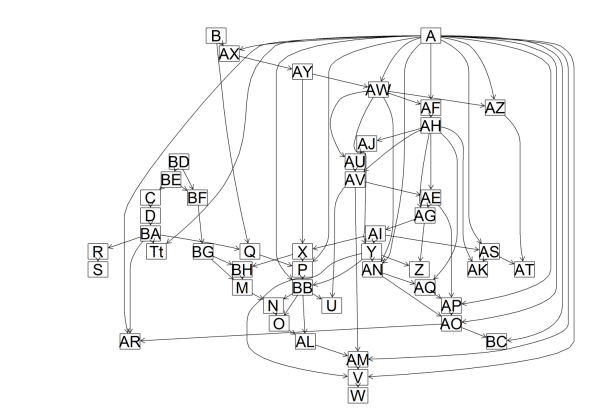

# Emotion Recognition from Video: An AI-Driven Approach
<picture>
  <source srcset="./readmePhotos/EMOTION.GAIT.png" media="(min-width: 680px)">
    <p align="center">  
        
    </p>
</picture>

Table of Contents
=============

* [Project Overview](#project-overview)
* [Model Architecture](#model-architecture)
* [Results](#results)
* [Future Work](#future-work)
* [Setup and Usage](#setup-and-usage)

This project presents an innovative approach for emotion recognition based on the analysis of human gait using artificial intelligence techniques. This non-intrusive method does not require facial capture, making it applicable in a variety of contexts, including smart home environments, emergency management, video surveillance, and healthcare. The model adopts a three-dimensional representation of emotions using the VAD (Valence, Arousal, Dominance) framework and employs a 3D pose model to analyze gait. 

In previous work, Recurrent Neural Networks (RNNs), particularly Long Short-Term Memory (LSTM) networks and Convolutional Neural Networks (CNNs), were employed to process sequential data and predict emotional trends. In this study, however, we modified the initial dataset to train Bayesian Neural Networks (BNNs). This shift allows us to incorporate probabilistic modeling, enabling more robust predictions by accounting for uncertainty in the model's outputs. 
The findings contribute to a deeper understanding of the intersection between artificial intelligence and emotion recognition, offering new perspectives for future applications.


## Project Overview

The updated project workflow uses a Bayesian Network to analyze statistical features extracted from video data. Unlike the original approach, which relied on the LSTM to capture temporal dependencies, the Bayesian Network provides a probabilistic framework to model uncertainties and relationships between features.

Key steps involved in the updated project include:

- **Data Preprocessing**: Frames are extracted and resized from video data. Emotional percentages are computed from the dataset, normalized, and used as features.

- **Feature Analysis and Selection**: Statistical features such as the percentages of detected emotions (`Happy`, `Sad`, `Angry`, `Neutral`) are computed for each video.

- **Classification**: A `Gaussian Naive Bayes (GNB)` classifier is employed to classify the extracted features into one of the target emotion categories. This probabilistic approach reduces computational costs compared to LSTMs while maintaining accuracy.

## Model Architecture

### Bayesian Network Architecture
The Bayesian Network approach focuses on simplicity and interpretability:
1. Features such as normalized percentages for emotions (`Happy`, `Sad`, `Angry`, `Neutral`) are computed from the video data.
2. A `Gaussian Naive Bayes` model processes the features. The classifier assumes independence between features, simplifying computation.
3. The output probabilities are used to determine the predicted emotion.

This architecture avoids the complexities of temporal sequence modeling required by LSTM networks, making it computationally efficient and easier to interpret.

<picture>
  <source srcset="./readmePhotos/rete.png" media="(min-width: 480px)">
  <p align="center">    
    
  </p>
</picture>

### Comparison to LSTM Architecture
The original model used a `TimeDistributed Conv2D` layer, multiple pooling and dense layers, and an `LSTM` layer for temporal analysis. While effective, this approach required extensive computational resources and was sensitive to dataset imbalance. The Bayesian approach addresses these limitations, providing a simpler and more robust solution.

## Methods 
### Improvements Made in the Current Work Compared to Previous Work
- **Addition of Zero Values**:  In the current dataset, we explicitly added zero values to represent cases where no emotion was perceived, instead of leaving cells empty. This ensured greater consistency in the data and avoided potential misinterpretations during model training.
- **Data Normalization**: All input data were normalized to ensure a uniform scale, reducing biases caused by varying value ranges. This preprocessing step was critical for improving the performance of machine learning models, particularly Bayesian Networks, which are highly sensitive to input scale differences.
- **Re-labeling of Classes**: We reorganized and refined the class labels for emotions to better capture the nuances of perceived emotional states. This provided the model with more granular information, enabling it to distinguish between complex emotional states rather than relying on coarse categorizations.
- **Probability Calculation**: We calculated the probability distributions of the normalized values and incorporated these into the training process of our Bayesian Network. This probabilistic approach significantly enhanced the model's reliability in generating accurate predictions.
### Oversampling Strategy and Cross-Validation
To address the inherent class imbalance in the dataset, we implemented oversampling techniques:
- **Random Oversampling** This method increased the representation of minority classes, allowing the model to generalize better. With this approach, the Bayesian Network achieved a remarkable accuracy of 95\%, with no signs of overfitting as verified through Cross-Validation.
- **SMOTE (Synthetic Minority Over-sampling Technique)**:
By generating synthetic samples for underrepresented classes, SMOTE improved the model's generalization capability in scenarios with more complex data distributions. The model trained on the SMOTE-augmented dataset achieved an accuracy of 84\%, slightly lower than that achieved with Random Oversampling, but with strong adaptability and robustness.

### Materials
In order to implement and validate our approach, we utilized a comprehensive suite of tools and technologies, ensuring robust and scalable development. Python was the programming language of choice due to its versatility and extensive ecosystem of libraries for machine learning, statistical modeling, and data manipulation.

The tools and libraries used in our project include:


- **PyBN**: For constructing Bayesian Networks, enabling probabilistic modeling and accounting for uncertainty in predictions
- **Scikit-learn**: Utilized for preprocessing, validation, and the application of traditional machine learning methods.
- **Imbalanced-learn**: Addressed the challenge of class imbalance using oversampling techniques like Random Oversampling and SMOTE.
- **NumPy and Pandas**: Core libraries for numerical computation and efficient data manipulation.
- **Matplotlib**: Used for generating visualizations, aiding in data exploration and interpretation.
- **TensorFlow and Keras**: Deployed for training and refining neural networks, including the integration of Bayesian Network components.
 - **OpenCV and Mediapipe**: These libraries facilitated video processing and pose estimation, crucial for extracting features from the gait data.
- **OpenPyXL**: Allowed seamless integration with Excel files for storing and managing the dataset.


## Results

In all, through a combination of data augmentation, probabilistic modeling, and rigorous cross-validation, we were able to transform a model that initially struggled with a 34\% accuracy into a robust system capable of achieving 95\% accuracy in optimal configurations. Our efforts in dataset creation, data normalization, and the use of advanced oversampling techniques have not only enhanced the predictive capabilities of our model but also ensured that it remains resilient against overfitting. This comprehensive approach underscores the value of leveraging both data quality and model optimization strategies to achieve superior performance in complex AI tasks.

## Discussion 
### Improvements
In this study, we introduced several key improvements to enhance the performance of the emotion recognition model, building upon the limitations identified in the initial project. Here are the main steps undertaken:

- **1. Initial Assessment of the Old Dataset and Model**: We began by importing the dataset from the previous project and re-training the existing LSTM-based model. This model achieved a baseline accuracy of 31%, which highlighted significant areas for improvement. These baseline results were discussed and confirmed as the foundation for further refinement during our class discussions.

- **2. Creation of a New Dataset**: Recognizing the shortcomings of the original dataset, we created a new, curated dataset of video samples annotated with specific emotional weights. This provided a more robust foundation for training and evaluation.

- **3. Dataset Normalization and Cleaning**: To ensure consistency and eliminate potential biases, the dataset was normalized, with all features scaled appropriately. Additionally, we addressed issues in the original dataset through extensive cleaning, ensuring that errors and inconsistencies were rectified. We also calculated the probability distributions of normalized values, making them suitable for Bayesian learning.

- **4. Implementation of Oversampling Techniques**: To tackle class imbalances in the dataset, we employed two oversampling techniques:

- **Random Oversampling**: By duplicating underrepresented samples, we ensured a more balanced dataset. Training the Bayesian network with this method, combined with Cross-Validation, resulted in a significant accuracy improvement, achieving 95% without overfitting.
**SMOTE (Synthetic Minority Oversampling Technique)**: This technique generated synthetic samples for minority classes, further balancing the dataset. Bayesian network training with SMOTE and Cross-Validation achieved an accuracy of 84%, with the model demonstrating strong adaptability and robustness.
- **5. Validation and Overfitting Prevention**: For each test, we rigorously validated the model to ensure robust performance and minimal overfitting. Cross-Validation was a key component of this process, confirming that the models generalized well to unseen data.

These improvements not only addressed the limitations of the initial approach but also resulted in a substantial enhancement of model performance, providing a solid foundation for future appl

## Future Work

Future directions for improving this project include:
- Incorporating multimodal data, such as audio and physiological signals, to enhance classification accuracy.
- Expanding the dataset to include more diverse scenarios for better generalization.
- Exploring hybrid approaches that combine the feature extraction capabilities of deep learning models with the probabilistic analysis of Bayesian Networks.

## Setup and Usage

### Training the Model
The Bayesian Network requires preprocessed video data and a `.csv` file containing normalized emotional percentages. 

Install the necessary dependencies:

```
pip install -r requirements.txt
```

Run the script to classify emotions using the Bayesian Network:
```
python bayesian_train_model.py
```

The results, including accuracy, precision, and confusion matrices, are displayed in the console. Probabilities for each emotion class are also shown, providing interpretability of the classifications.

